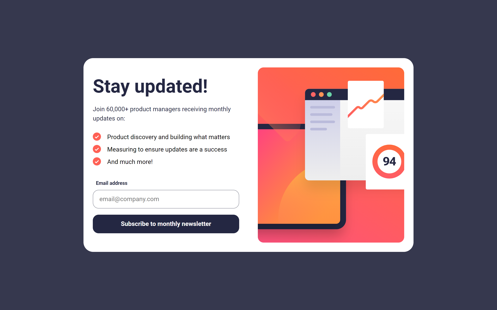
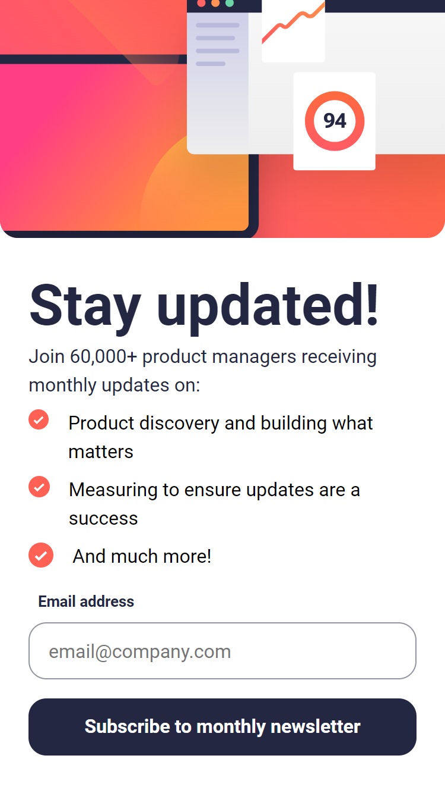

# Frontend Mentor - Newsletter sign-up form with success message
This is a solution to the [Newsletter sign-up form with success message challenge on Frontend Mentor](https://www.frontendmentor.io/challenges/newsletter-signup-form-with-success-message-3FC1AZbNrv). Frontend Mentor challenges help you improve your coding skills by building realistic projects. 

## The challenge

The challenge is to build out this newsletter form where the users should be able to:

- Add their email and submit the form
- See a success message with their email after successfully submitting the form
- See form validation messages if:
- The field is left empty
- The email address is not formatted correctly
- View the optimal layout for the interface depending on their device's screen size
- See hover and focus states for all interactive elements on the page

### Links

- Solution URL: [Github](https://github.com/juanmderosa/newsletter-sign-up)
- Live Site URL: [Github Pages](https://juanmderosa.github.io/newsletter-sign-up/)

### Built with
- [React](https://reactjs.org/) - JS library
- SASS
- Semantic HTML5 markup
- CSS custom properties
- Flexbox
- Responsive Workflow

## Author

- Website - [juanmderosa-developer.com.ar](juanmderosa-developer.com.ar)
- Frontend Mentor - [@juanmderosa](https://www.frontendmentor.io/profile/juanmderosa)
- Linkedin - [Juan Martín De Rosa](https://www.linkedin.com/in/juanmderosa/)
